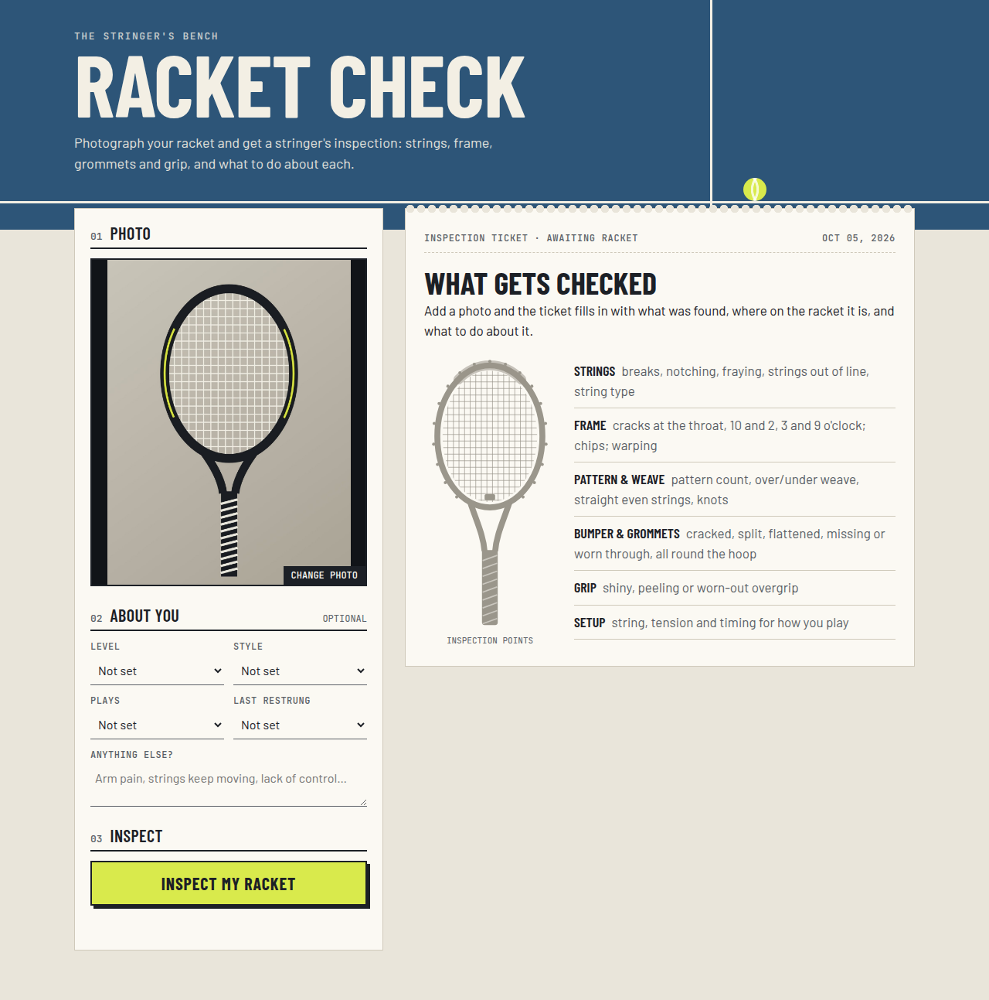
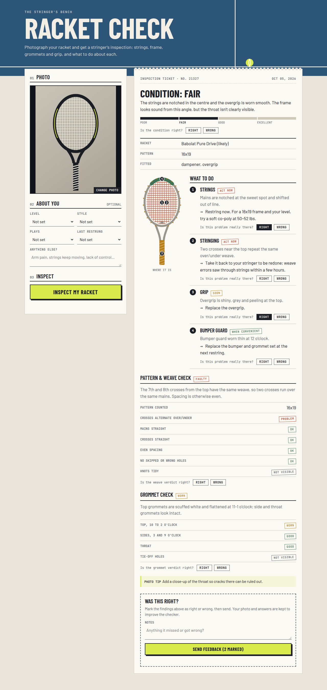
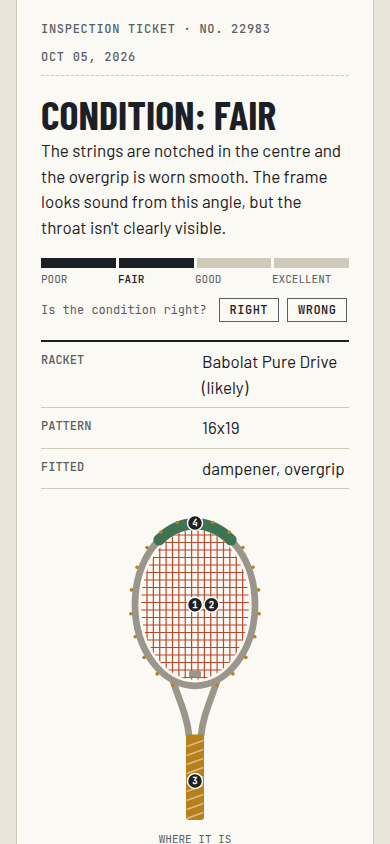

# Tennis
All about Tennis rackets

## Racket Check

A web page where you take or upload a photo of your tennis racket and get
suggestions on what to change: strings, grip, frame, bumper guard, dampener and
overall setup. You can also add your level, playing style and how often you play
to get better suggestions.

The photo is analyzed by Claude (vision) through a small Node/Express server, so
your API key stays on the server and never reaches the browser.



The result is an inspection ticket: overall condition, what to do (each fix
stamped "Act now", "Soon" or "When convenient"), a racket diagram showing where
each problem is, a pattern & weave check, a grommet check, and Right / Wrong
buttons for feedback.

<p>
  
  
</p>

_Screenshots use a drawn racket and a sample result, not a real analysis._

### Run it

```bash
npm install
export ANTHROPIC_API_KEY=sk-ant-...   # your Anthropic API key
npm start
```

Open http://localhost:3000. On a phone on the same network, open
`http://<your-computer-ip>:3000`; the upload button lets you use the camera.

### How it works

- `public/` holds the page. It shrinks the photo in the browser to 1568px max
  and sends it to the server as JPEG.
- `server.js` serves the page and has `POST /api/analyze`, which calls
  `lib/analyze.js`. That sends the photo and player info to `claude-opus-5-5`
  and asks for JSON that matches
  a fixed schema (structured outputs). The JSON holds the overall condition,
  racket details, a priority-sorted list of recommendations, and two checks
  that are always filled in, even when everything looks fine:
  - **Grommet check**: a verdict (good, worn, damaged, not visible) for the
    top, sides, throat and tie-off holes.
  - **Pattern & weave check**: the counted pattern plus over/under weave,
    straight mains and crosses, spacing, holes and knots.

### Knowledge base

`knowledge/racket-inspection.md` holds the inspection guide Claude follows:
signs that strings need replacing, how to spot frame cracks, bumper guard,
grommet and grip wear, string pattern and weave faults, string types and
tension, arm-comfort advice and a priority guide. The server loads it into the
instructions at startup, so edit the file and restart to change how rackets are
judged. Its sources (web pages
and YouTube videos) are listed in `knowledge/SOURCES.md`.

### Teaching it with your own photos

Claude Opus 5.5 can't be retrained, but two folders let you improve it with
real racket photos:

- **Reference photos** (`knowledge/examples/`): labelled photos of each
  condition (notched strings, a cracked grommet, a weave error, and healthy
  examples). They are sent with every analysis as examples and cached. See
  `knowledge/examples/README.md`.
- **Test photos** (`evals/`): photos with the correct answers written down.
  `npm run eval` runs the analyzer on all of them and reports how often each
  check is right, so you can tell whether a change helps. See
  `evals/README.md`.

The analysis itself lives in `lib/analyze.js`, shared by the web server and
the scoring script.

### Feedback

Each finding, the condition and both checks on the ticket have **Right** /
**Wrong** buttons. For a verdict marked wrong, the player can pick the correct
value, and there's a box for anything it missed. **Send feedback** saves the
photo and answers on the server in `feedback/<id>/` (not committed). The page
tells players their photo is kept.

```bash
npm run import-feedback -- --dry-run   # show what would become test cases
npm run import-feedback                # add them to evals/cases.json
```

The import turns the answers into test cases: a confirmed or corrected verdict
becomes the expected answer, and a strings, frame or grip finding marked wrong
becomes "not a problem". Answers that contradict each other are dropped.
Review the new cases before trusting the score, since players can be wrong
too.
